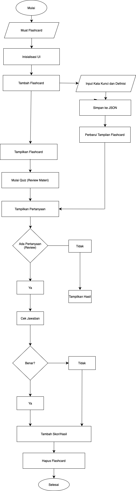
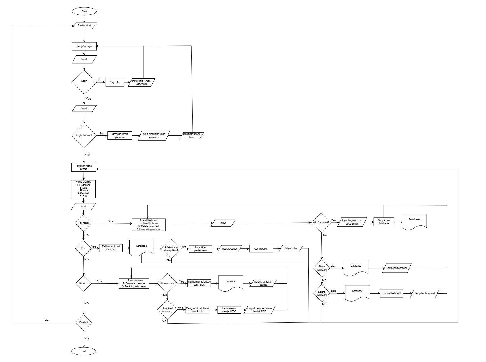

# Kelas B, Kelompok 3
# Nama Anggota Kelompok:
1. Aisyah Nur Aini            (I0324071)
2. Ajeng Oktavia Ramadhan     (I0324972)
3. Bernadetta Jessi Adventya  (I0324074)

# Deskripsi
Flashcard Digital adalah aplikasi desktop yang membantu siswa belajar dengan kartu kilat digital. Pengguna dapat memasukkan kata kunci dan penjelasan materi, yang ditampilkan sebagai flashcard berwarna-warni. Aplikasi ini juga menyediakan kuis singkat untuk review materi dengan jawaban langsung ditampilkan di layar, serta menyimpan flashcard.

# Fitur - Fitur Aplikasi
1. Flashcard
   Pada fitur ini dibagi menjadi beberapa fitur, yaitu:
    - Add Flashcard     : merupakan fitur untuk kita menambahkan kata kunci dan materinya.
    - Show Flashcard 	: merupakan fitur yang akan menampilkan Kumpulan kata kunci dan materi yang sebelumnya sudah kita tambahkan.
    - Delete Flashcard	: merupakan fitur untuk menghapus kata kunci dan materi yang sebelumnya ditambahkan.
2. Quiz
   Pada fitur ini, materi yang sebelumnya sudah ditambahkan dalam flashcard akan ditampilkan menjadi pertanyaan dan di akhir quiz akan ada hasil skor benar dari                 pertanyaan yang sudah dijawab.
3. Resume
   Pada fitur ini akan dibagi menjadi 2 fitur, yaitu:
    - Show Resume       : fitur ini akan menampilkan resume dari materi yang kita tambahkan dan kita pelajari.
    - Download Resume   : pada fitur ini resume materi dapat kita download dalam bentuk file pdf.
       
# Libary
Program Aplikasi Flashcard Digital, menggunakan beberapa library sebagai berikut:
1. json          : digunakan untuk membaca data dan menulis data pengguna dari dan ke file JSON
2. os            : digunakan untuk memeriksa keberadaan file JSON              
3. smtplib       : digunakan untuk mengirim email melalui server SMTP
4. email.message : digunakan untuk membuat pesan email
5. random        : digunakan untuk menghasilkan angka acak dan mengacak warna
6. tkinter       : digunakan untuk membuat dan mengelola antarmuka pengguna grafis (GUI)
7. PIL.Image     : digunakan untuk menangani dan menampilkan gambar dalam antarmuka Tkinter
8. reportlab     : digunakan untuk membuat file PDF
    
# Flowchart

# Flowchart Revisi

Flowchart ini menunjukkan alur dari aplikasi flashcard digital. Proses dimulai dengan pengguna menekan tombol start untuk memulai aplikasi. Setelah itu, pengguna akan disajikan layar login. Jika login berhasil, pengguna akan diarahkan ke menu utama. Jika login gagal, pengguna dapat memilih untuk mendaftar atau mereset kata sandi. Untuk mendaftar, pengguna harus memasukkan data email dan kata sandi. Jika memilih untuk mereset kata sandi, pengguna harus memasukkan email dan kode verifikasi, lalu menetapkan kata sandi baru. Di menu utama, pengguna dapat memilih Flashcard, Quiz, Resume, Back, atau Exit. Dalam menu Flashcard, pengguna bisa melihat, menambah, atau menghapus flashcard. Untuk menambah flashcard, pengguna memasukkan kata kunci dan deskripsi yang kemudian disimpan ke database. Untuk menghapus, pengguna memilih flashcard yang akan dihapus dari database. Pada menu Quiz, aplikasi mengambil pertanyaan dari database, pengguna menjawabnya, dan sistem memberikan skor berdasarkan jawaban. Pada menu Resume, pengguna bisa melihat atau mengunduh resume dalam format PDF, dengan proses konversi dari database ke JSON lalu ke PDF. Pengguna dapat kembali ke menu utama kapan saja. Menu Exit memungkinkan pengguna untuk keluar dari aplikasi dan mengakhiri sesi penggunaan.

# Sitemap

