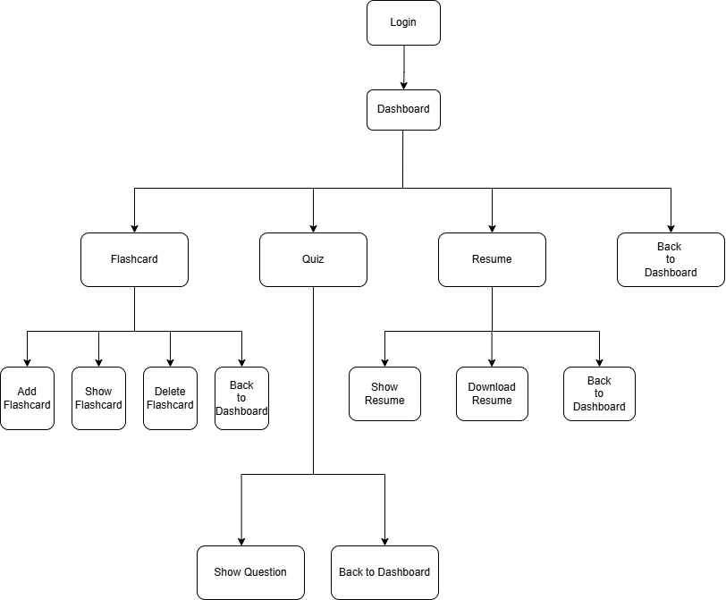

# Kelas B, Kelompok 3
# Nama Anggota Kelompok:
1. Aisyah Nur Aini            (IO324071)
2. Ajeng Oktavia Ramadhan     (I0324972)
3. Bernadetta Jessi Adventya  (I0324074)

# Deskripsi
Flashcard Digital adalah aplikasi desktop yang membantu siswa belajar dengan kartu kilat digital. Pengguna dapat memasukkan kata kunci dan penjelasan materi, yang ditampilkan sebagai flashcard berwarna-warni. Aplikasi ini juga menyediakan kuis singkat untuk review materi dengan jawaban langsung ditampilkan di layar, serta menyimpan flashcard.

# Fitur - Fitur Aplikasi
1. Flashcard (Add Flashcard Flashcard, Show Flashcard, Delete Flashcard)
2. Quiz
3. Resume PDF (Show Resume, Download Resume to PDF File)

# Flowchart
Flowchart 1

# Flowchart Revisi

# Sitemap

